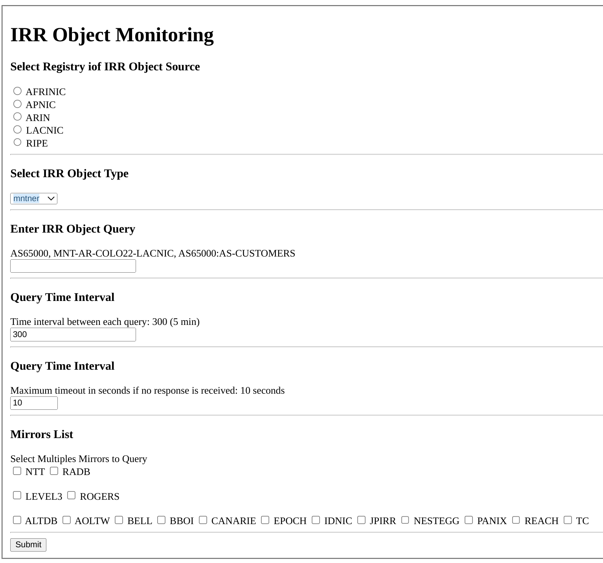
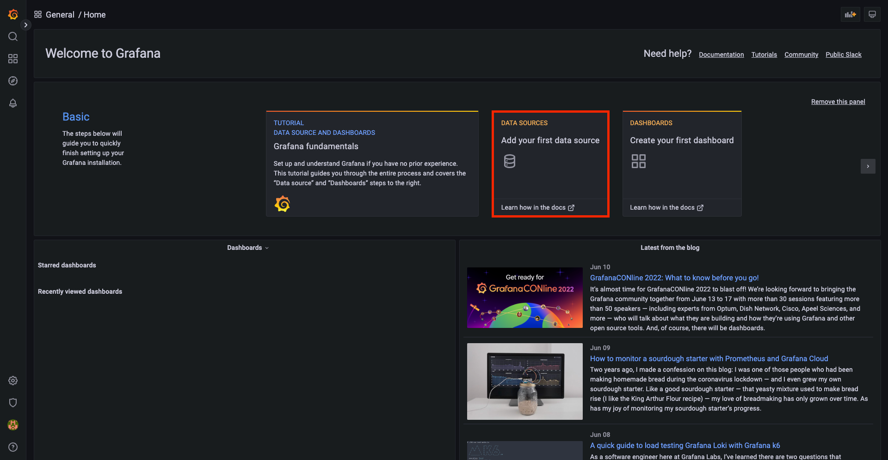
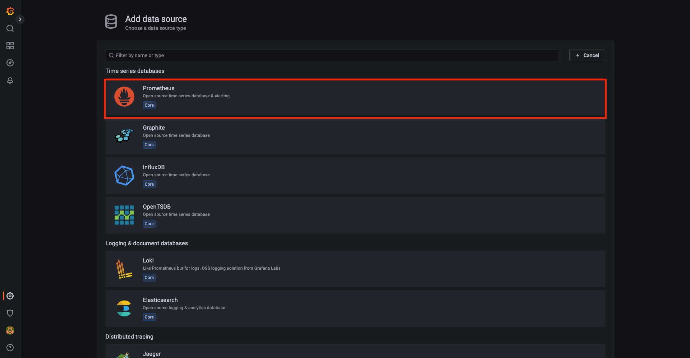
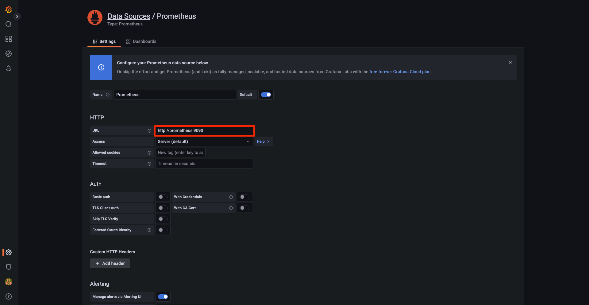
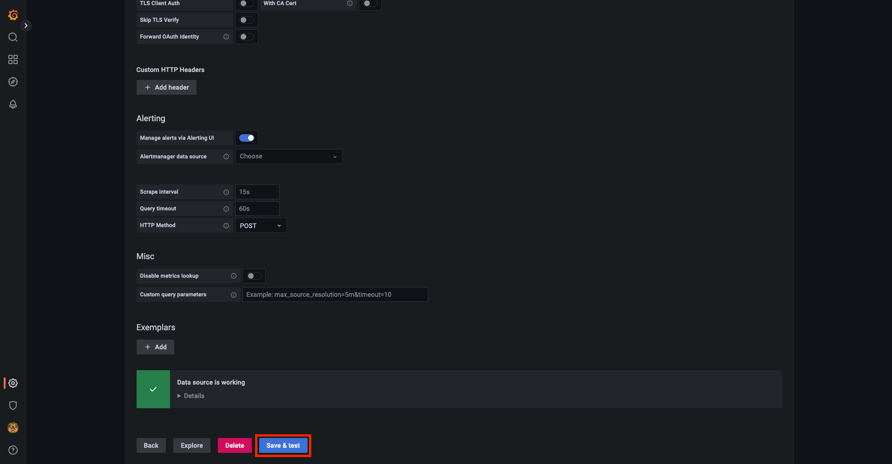
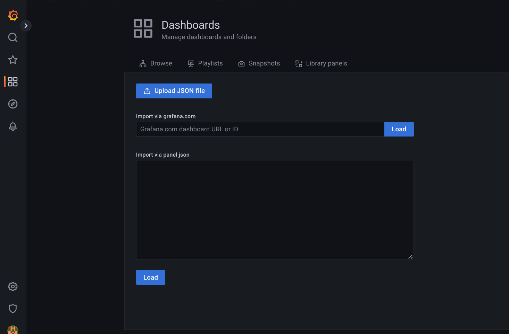
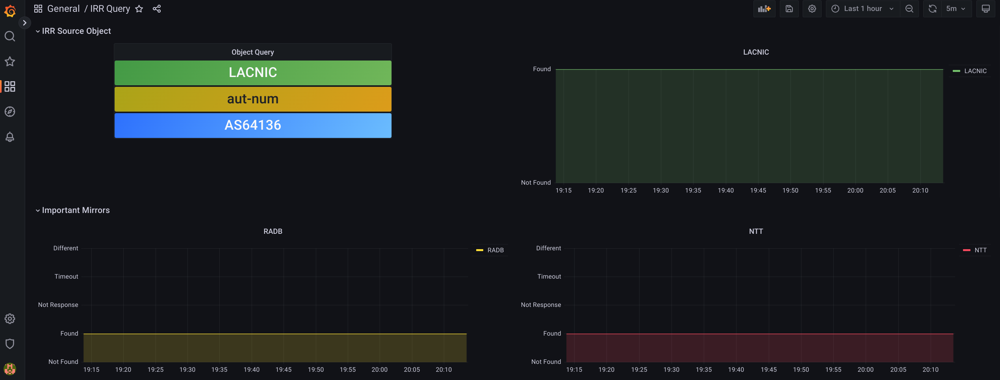

### IRRMON: IRR Object Monitoring

------

IRRMON es un proyecto para monitorear el tiempo de propagación de un objeto IRR desde que es creado o modificado en alguno de los RIRs  (AFRINIC, APNIC, ARIN, LACNIC y RIPE) y es encontrado en un mirror. 

La aplicación consiste de un conjunto de contenedores docker que cumplen las siguientes funciones:

- Un proceso App que realiza las consultas del objeto a monitorear utilizando whois sobre cada mirror a consultar.  Esta App genera logs del estado de las consultas y métricas que exporta mediante un cliente Prometheus.
- Un formulario web donde se ingresa el tipo de objeto a monitorear, se seleccionan los mirrors a consultar y otros parámetros como son el intervalo de tiempo entre consultas y el tiempo de espera de respuesta del mirror. 
- Un servidor Prometheus que extrae los datos del exportador.
- Un dashboard para Grafana que genera gráficos utilizando Prometheus como fuente de datos

#### Docker

Luego de clonar este repositorio contruimos primero los contenedores docker   

```
docker-compose build
```

y para correrlo ejecutamos

```
docker-compose up -d
Creating network "irrmon_default" with the default driver
Creating volume "irrmon_grafana-storage" with default driver
Creating irrmon_prometheus_1 ... done
Creating irrmon_lighttpd_1   ... done
Creating irrmon_grafana_1    ... done
Creating irrmon_app_1        ... done
```

Luego verificamos que los 4 contenedores se están ejecutando:

```
CONTAINER ID   IMAGE             COMMAND                  CREATED         STATUS         PORTS                                       NAMES
f53668fbbd69   irrmon_app        "python3 ./irrmon.py"    9 seconds ago   Up 8 seconds   0.0.0.0:8000->8000/tcp, :::8000->8000/tcp   irrmon_app_1
de0219cf08b3   irrmon_lighttpd   "/usr/sbin/lighttpd …"   9 seconds ago   Up 8 seconds   0.0.0.0:80->80/tcp, :::80->80/tcp           irrmon_lighttpd_1
0a41b420fddb   grafana/grafana   "/run.sh"                9 seconds ago   Up 8 seconds   0.0.0.0:3000->3000/tcp, :::3000->3000/tcp   irrmon_grafana_1
5735229a0080   prom/prometheus   "/bin/prometheus --c…"   9 seconds ago   Up 8 seconds   0.0.0.0:9090->9090/tcp, :::9090->9090/tcp   irrmon_prometheus_1
```

#### Objeto a monitorear

Utilizando un Navegador, ingresar al url http://localhost y se obtiene un formulario web donde se definen los parámetros de la consulta a realizar.



#### Prometheus

Para verificar la salida de la métrica del exportador Prometheus nos conectamos al puerto 8000 del localhost: http://localhost:8000

```
curl http://localhost:8000
# HELP irr_query_object_source Query object IRR source
# TYPE irr_query_object_source gauge
irr_query_object_source{querySourceIRR="LACNIC"} 1.0
# HELP irr_query_object_type Query object type
# TYPE irr_query_object_type gauge
irr_query_object_type{queryObjectType="aut-num"} 1.0
# HELP irr_query_object Query object
# TYPE irr_query_object gauge
irr_query_object{queryObject="AS64136"} 1.0
# HELP irr_query_interval Queries interval in seconds
# TYPE irr_query_interval gauge
irr_query_interval{queryInterval="300"} 1.0
# HELP irr_query_timeout Timeout response in seconds
# TYPE irr_query_timeout gauge
irr_query_timeout{queryTimeout="10"} 1.0
# HELP irr_query_object_found IRR object query result: not found (0), found (1), empty response (2), timeout (3)
# TYPE irr_query_object_found gauge
irr_query_object_found{irr="ALTDB",response="D"} 0.0
irr_query_object_found{irr="AOLTW",response="N"} 2.0
irr_query_object_found{irr="EPOCH",response="T"} 3.0
irr_query_object_found{irr="LACNIC",response="A"} 1.0
irr_query_object_found{irr="LEVEL3",response="A"} 1.0
irr_query_object_found{irr="NESTEGG",response="D"} 0.0
irr_query_object_found{irr="NTT",response="A"} 1.0
irr_query_object_found{irr="RADB",response="A"} 1.0
irr_query_object_found{irr="REACH",response="D"} 0.0
irr_query_object_found{irr="ROGERS",response="A"} 1.0
irr_query_object_found{irr="TC",response="D"} 0.0
# HELP irr_number_of_queries_cycles_total Number of queries cycles to all the Registries
# TYPE irr_number_of_queries_cycles_total counter
irr_number_of_queries_cycles_total 44.0
# HELP irr_number_of_queries_cycles_created Number of queries cycles to all the Registries
# TYPE irr_number_of_queries_cycles_created gauge
irr_number_of_queries_cycles_created 1.6675028112463198e+09
```

#### Graphana		

Para ingresar a la plataforma de visualización de monitoreo del objeto que ofrece graphana, nos conectamos al puerto 3000 del localhost y obtenemos el dashboard predeterminado



Luego, selecccione **Prometheus** como data source:



Ingresar en el campo URL el servicio prometheus dockerizado: ***http://prometheus:9090*** 




Y finalmente click el boton ***Save & Test*** para confirmar la fuente de datos.



Ahora es necesario ***importar*** el dashboard que se encuentra en el archivo IRR_Query.json. Para esto es necesario ingresar a  http://localhost:3000/dashboard/import , ir a ***Dashboards*** y selecionar ***Upload Json File***. Luego selecionar en el directorio del repositorio local el dashboard contenido en el archivo ***IRRMON_Query.json*** y al final de la página seleccionar ***Prometheus*** como fuente de datos.



Finalmente podemos ver el objeto a monitorear y las gráficas del RIR fuente, de mirrors especificos a seguir y del estado de las respuestas  del resto de los mirrors consultados. 




> **Importante:** para ingresar a grafana utilizar usuario y palabra clave definida en el archivo docker-composer.yml


#### Ansible

Para automatizar el proceso de instalación del contenedor docker de forma remota en una maquina virtual se dispone del playbook para correr en ansible. Los pasos para esto son:

***En construcción!!!!!!***

