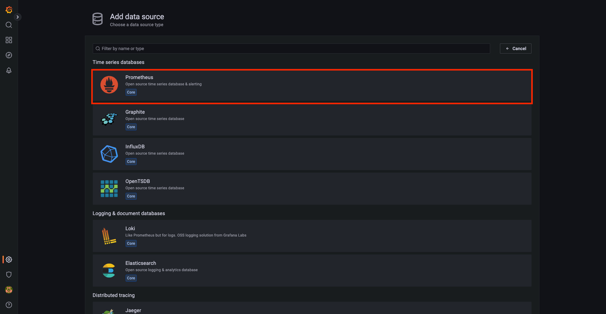
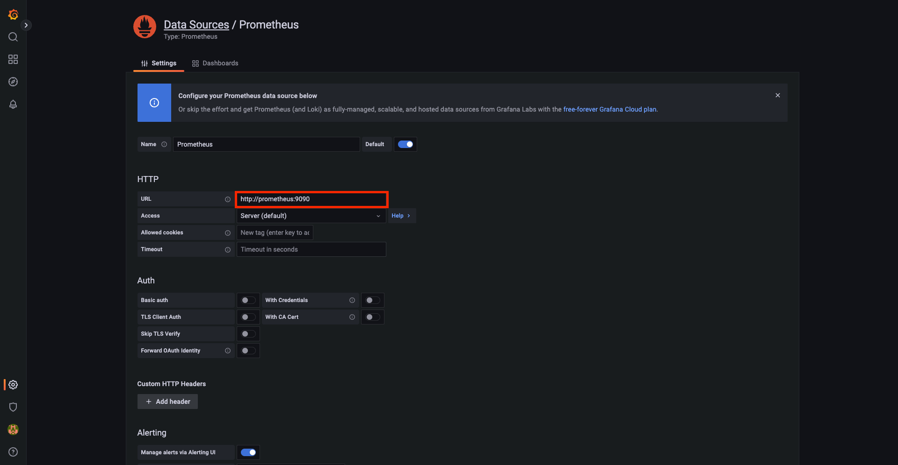
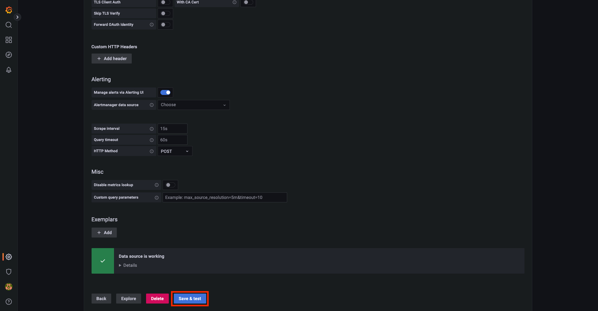
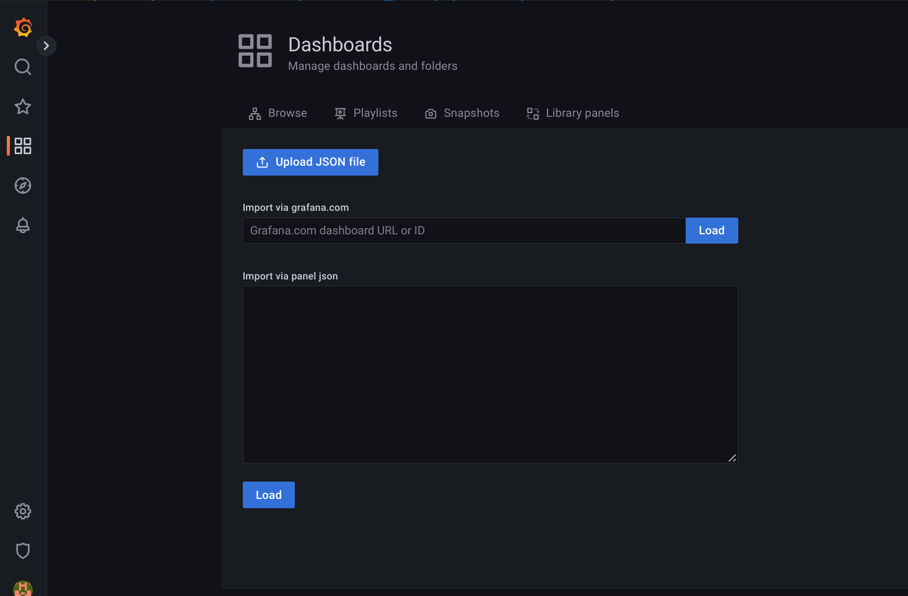
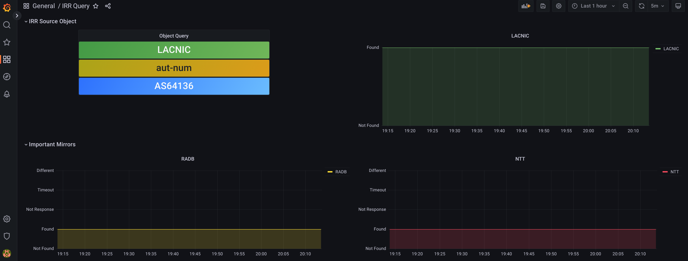

## IRRMON: IRR Object Monitoring

------

IRRMON is a project to monitor the propagation time of an IRR object since it is created or modified in one of the RIRs (AFRINIC, APNIC, ARIN, LACNIC and RIPE) and is found in a mirror.

The application consists of a set of docker containers that fulfill the following functions:

- An App process that queries the object to be monitored using whois on each mirror to query. This App generates query status logs and metrics that it exports through a Prometheus client.
- A web form where the type of object to be monitored is entered, the mirrors to be queried are selected and other parameters such as the time interval between queries and the response time from the mirror.
- A Prometheus server that extracts the data from the exporter.
- A dashboard for Grafana that generates graphs using Prometheus as data source

Next we see the step by step to run the project.

------

### Docker

After cloning this repository we first build the docker containers:

```
docker-compose build
```

and to run it we execute:

```
docker-compose up -d
Creating network "irrmon_default" with the default driver
Creating volume "irrmon_grafana-storage" with default driver
Creating irrmon_prometheus_1 ... done
Creating irrmon_lighttpd_1   ... done
Creating irrmon_grafana_1    ... done
Creating irrmon_app_1        ... done
```

Then we verify that all 4 containers are running:

```
docker ps
CONTAINER ID   IMAGE             COMMAND                  CREATED         STATUS         PORTS                                       NAMES
f53668fbbd69   irrmon_app        "python3 ./irrmon.py"    9 seconds ago   Up 8 seconds   0.0.0.0:8000->8000/tcp, :::8000->8000/tcp   irrmon_app_1
de0219cf08b3   irrmon_lighttpd   "/usr/sbin/lighttpd …"   9 seconds ago   Up 8 seconds   0.0.0.0:80->80/tcp, :::80->80/tcp           irrmon_lighttpd_1
0a41b420fddb   grafana/grafana   "/run.sh"                9 seconds ago   Up 8 seconds   0.0.0.0:3000->3000/tcp, :::3000->3000/tcp   irrmon_grafana_1
5735229a0080   prom/prometheus   "/bin/prometheus --c…"   9 seconds ago   Up 8 seconds   0.0.0.0:9090->9090/tcp, :::9090->9090/tcp   irrmon_prometheus_1
```

------

### Object to monitor

Using a browser, enter the url http://localhost and a web form is obtained where the parameters of the query to be performed are defined.


------

### Prometheus

To verify the output of the metric from the Prometheus exporter, we connect to port 8000 of the localhost: http://localhost:8000

```
curl http://localhost:8000
# HELP irr_query_object_source Query object IRR source
# TYPE irr_query_object_source gauge
irr_query_object_source{querySourceIRR="LACNIC"} 1.0
# HELP irr_query_object_type Query object type
# TYPE irr_query_object_type gauge
irr_query_object_type{queryObjectType="aut-num"} 1.0
# HELP irr_query_object Query object
# TYPE irr_query_object gauge
irr_query_object{queryObject="AS64136"} 1.0
# HELP irr_query_interval Queries interval in seconds
# TYPE irr_query_interval gauge
irr_query_interval{queryInterval="300"} 1.0
# HELP irr_query_timeout Timeout response in seconds
# TYPE irr_query_timeout gauge
irr_query_timeout{queryTimeout="10"} 1.0
# HELP irr_query_object_found IRR object query result: not found (0), found (1), empty response (2), timeout (3)
# TYPE irr_query_object_found gauge
irr_query_object_found{irr="ALTDB",response="D"} 0.0
irr_query_object_found{irr="AOLTW",response="N"} 2.0
irr_query_object_found{irr="EPOCH",response="T"} 3.0
irr_query_object_found{irr="LACNIC",response="A"} 1.0
irr_query_object_found{irr="LEVEL3",response="A"} 1.0
irr_query_object_found{irr="NESTEGG",response="D"} 0.0
irr_query_object_found{irr="NTT",response="A"} 1.0
irr_query_object_found{irr="RADB",response="A"} 1.0
irr_query_object_found{irr="REACH",response="D"} 0.0
irr_query_object_found{irr="ROGERS",response="A"} 1.0
irr_query_object_found{irr="TC",response="D"} 0.0
# HELP irr_number_of_queries_cycles_total Number of queries cycles to all the Registries
# TYPE irr_number_of_queries_cycles_total counter
irr_number_of_queries_cycles_total 44.0
# HELP irr_number_of_queries_cycles_created Number of queries cycles to all the Registries
# TYPE irr_number_of_queries_cycles_created gauge
irr_number_of_queries_cycles_created 1.6675028112463198e+09
```

------

### Graphana		

To access the object monitoring visualization platform offered by graphana, we connect to port 3000 of the localhost and obtain the default dashboard


Next, select **Prometheus** as the data source:



 Enter the dockerized prometheus service in the URL field: ***http://prometheus:9090***



And finally click the ***Save & Test*** button to confirm the data source.



Now we need to ***import*** the dashboard found in the IRR_Query.json file. For this it is necessary to enter http://localhost:3000/dashboard/import , go to ***Dashboards*** and select ***Upload Json File***. Then select the dashboard contained in the ***IRRMON_Query.json*** file in the local repository directory and at the bottom of the page select ***Prometheus*** as data source.



Finally we can see the object to monitor and the graphs of the source RIR, of specific mirrors to follow and of the status of the responses of the rest of the consulted mirrors.




> **Important:** to enter grafana use user and password defined in the docker-composer.yml file

------

### Ansible

To automate the installation process of the docker container remotely in a virtual machine, the playbook is available to run in ansible. The steps for this are:

- Verify the version of ansible installed on the control machine is >= 2.9.20.

  ```
  ansible --version
  ansible [core 2.12.10]
    config file = /etc/ansible/ansible.cfg
    configured module search path = ['/home/santiago/.ansible/plugins/modules', '/usr/share/ansible/plugins/modules']
    ansible python module location = /usr/lib/python3/dist-packages/ansible
    ansible collection location = /home/santiago/.ansible/collections:/usr/share/ansible/collections
    executable location = /usr/bin/ansible
    python version = 3.8.10 (default, Jun 22 2022, 20:18:18) [GCC 9.4.0]
    jinja version = 2.10.1
    libyaml = True
  ```

  If you need to update ansible you can reference the page https://launchpad.net/~ansible/+archive/ubuntu/ansible

  ```
  sudo add-apt-repository ppa:ansible/ansible
  sudo apt update
  sudo apt upgrade
  ```

  Finally it is necessary to install the latest version of the community.docker collection

  ```
  ansible-galaxy collection install community.docker
  ```

- Change to the directory where the ansible playbooks are located

  ```
  cd ansible/playbooks
  ```

- In the ***hosts*** file change the ansible variables needed to connect to the remote virtual machine

  ```
  cat hosts
  remote ansible_ssh_host=remote.example.net ansible_python_interpreter='/usr/bin/python3'
  ```

- Run the playbook for the remote deployment of the application

  ```
  ansible-playbook -i hosts irrmon.yml
  ```

- If the deployment succeeds, the last task executed by the ansible-playbook command returns:

  ```
  TASK [debug] *****************************************************************************************************************
  ok: [nodo] => {
      "result.stdout_lines": [
          "CONTAINER ID   IMAGE             COMMAND                  CREATED         STATUS         PORTS                    NAMES",
          "c697b85a932a   irrmon_app        \"python3 ./irrmon.py\"    3 seconds ago   Up 1 second    0.0.0.0:8000->8000/tcp   irrmon_app_1",
          "249e7569e702   prom/prometheus   \"/bin/prometheus --c…\"   7 seconds ago   Up 3 seconds   0.0.0.0:9090->9090/tcp   irrmon_prometheus_1",
          "833b398717e5   irrmon_lighttpd   \"/usr/sbin/lighttpd …\"   7 seconds ago   Up 4 seconds   0.0.0.0:80->80/tcp       irrmon_lighttpd_1",
          "d78a0ee3a5ac   grafana/grafana   \"/run.sh\"                7 seconds ago   Up 2 seconds   0.0.0.0:3000->3000/tcp   irrmon_grafana_1"
      ]
  }
  ```

  This tells us that all 4 containers are running and now we can get back to the point 

  ***Object to monitor***

  
